# purbo-skills

AI agent skills that encode engineering taste.

## Installation

```bash
# Install all skills (works with Claude Code, Cursor, and 40+ agents)
npx skills add mpurbo/purbo-skills

# Install a specific skill
npx skills add mpurbo/purbo-skills --skill fp-rust
```

## Skill Families

### FP — Functional Programming

Opinionated skills for FP-first development. Pure-core/imperative-shell architecture, immutability by default, algebraic data types, dependency rejection over injection, and pipeline-oriented programming.

#### fp-rust

Functional Programming in Rust — guidelines for writing idiomatic, FP-first Rust code.

**Covers:** functional core / imperative shell architecture, immutability-first patterns (borrow > clone > mutate), pure functions, algebraic data types, pipeline-oriented programming with iterators and Result chains, error handling as data, dependency rejection over dependency injection, type-driven design (parse don't validate, typestate), concurrency via message passing, and recommended crate stack.

**Triggers on:** any Rust coding task — planning, writing, reviewing, refactoring, scaffolding, project setup, Cargo.toml configuration, or code review.

**Based on:** [Functional Rust: Idiomatic FP Guidelines](skills/fp-rust/references/FP_RUST_GUIDELINES.md), cross-referenced with [Apollo GraphQL Rust Best Practices](https://github.com/apollographql/rust-best-practices).

#### fp-kstream-design

Design Kafka Streams topologies using [Kafka Stream Algebra (KSA)](skills/fp-kstream-design/references/KSA.md) patterns. Produces Mermaid topology diagrams, recipe selection, cost estimates, and compliance checks.

**Triggers on:** "design a topology", "kafka architecture", "stream processing design", "what pattern should I use", "topology review", "KSA".

#### fp-kstream-implement

Implement topologies as testable, deterministic code with pure business logic separated from Kafka wiring. Includes code patterns (stateless transforms, FSMs, enrichment), testing strategy (3-layer), local dev setup (Docker Compose), and Gradle build config.

**Triggers on:** "implement this topology", "write the KStream code", "create the processor", "set up kafka locally", "write tests", "KStream implementation".

**Based on:** [Kafka Stream Algebra v0.5](skills/fp-kstream-implement/references/KSA.md) — 10 composable recipes covering ingress, enrichment, computation, and egress patterns.

---

### Spec-Driven Development

An opinionated AI-assisted development workflow built on top of [OpenSpec](https://github.com/fission-ai/openspec). Starts from a high-level System Spec, progressively refines into per-subsystem Design Specs with contract-bounded phases, then feeds each phase into OpenSpec's standard change workflow.

#### The workflow

```
1. Brainstorm          -> System Spec (high-level, subsystem boundaries)
2. Deep-dive           -> Subsystem Design Spec (per-subsystem, phases, contracts)
                          Produces conventions.md after first subsystem
3. Configure OpenSpec  -> config.yaml (project context + phase-scoped context)
4. Phase context switch -> Update config.yaml with current phase + consumed contracts
5. Per-phase OpenSpec  -> proposal -> specs -> design -> tasks -> apply -> archive
                          Review depth based on phase review tier
6. Next phase          -> Repeat from step 4
7. Next subsystem      -> Repeat from step 2, loading conventions.md
```

| Step | Skill | What Happens |
|------|-------|-------------|
| 1. Brainstorming | `superpowers:brainstorming` | Explore intent, architecture, subsystem boundaries. Produces System Spec. |
| 2. Subsystem deep-dive | `subsystem-design-spec` | Creates detailed per-subsystem spec with phases, verification guides, and review tiers. After first subsystem, produces `conventions.md` for follow-on consistency. |
| 3. OpenSpec setup | `openspec-config` | Generates `config.yaml` with project-wide context and rules. Does NOT load the full design spec — only phase-scoped context. |
| 4. Phase context switch | `openspec-config` (Step 6) | Updates `config.yaml` with current phase section + consumed contract signatures only (~20 lines vs ~1000). |
| 5. OpenSpec per phase | OpenSpec standard flow | Each phase becomes one OpenSpec change. Human review depth follows the phase's review tier (gate-only / spot-check / full-review). |
| 6. Next phase | `openspec-config` (Step 6) | Switch phase context, repeat OpenSpec flow. |
| 7. Next subsystem | `subsystem-design-spec` (follow-on mode) | Loads `conventions.md` instead of re-scanning all prior specs. |

#### Document hierarchy

```
System Spec                    <- high-level: subsystem boundaries, tenets
  |
  |-- conventions.md           <- extracted after first subsystem, ~30 lines
  |
  |-- Subsystem Design Spec    <- mid-level: architecture, user stories,
  |   (one per subsystem)         design decisions, implementation phases
  |
  |-- OpenSpec changes         <- per-phase: proposal, specs, design,
      (one per phase)             tasks, apply, archive
```

**System Spec** = what to build and how subsystems relate. Created via brainstorming.

**conventions.md** = lightweight file (~30 lines) with established naming patterns, section structure, phase coding, and cross-subsystem contracts. Produced after the first subsystem, updated after each subsequent one. Eliminates re-scanning all prior specs.

**Subsystem Design Spec** = how to build one subsystem. Includes design decisions (`D1`, `D2`...), user stories (`US-{n}`) with acceptance criteria (`AC-{n}.{y}`), implementation phases (`S{n}.{m}`) with review tiers and verification guides. Created via `subsystem-design-spec`.

**OpenSpec changes** = executable implementation. One change per phase from the design spec. Config.yaml carries only the current phase's context (~20 lines), not the full spec (~1000 lines). Configured via `openspec-config`.

```mermaid
%%{init:{'theme':'base','themeVariables':{'primaryTextColor':'#1e293b','lineColor':'#475569','edgeLabelBackground':'#ffffff','tertiaryTextColor':'#1e293b'}}}%%
flowchart TD
    subgraph pre_openspec ["Pre-OpenSpec: Spec Authoring"]
        Brain["Brainstorm with AI"]
        SysSpec["System Spec"]
        SubSpec["Subsystem Design Spec<br/>(phases, contracts, review tiers)"]
        Conv["conventions.md<br/>(after first subsystem)"]

        Brain --> SysSpec
        SysSpec --> SubSpec
        SubSpec --> Conv
    end

    subgraph config_phase ["OpenSpec Setup (per subsystem)"]
        Config["openspec-config<br/>Project context + rules"]
    end

    subgraph phase_loop ["Per-Phase Loop"]
        PhaseCtx["Phase context switch<br/>(~20 lines vs ~1000)"]
        Init["openspec init"]
        Proposal["proposal"]
        Specs["specs"]
        Design["design"]
        Tasks["tasks"]
        Apply["apply + TDD"]
        Gate{"Phase gate<br/>passes?"}
        Review["Human review<br/>(tier: gate-only | spot-check | full)"]
        Archive["archive"]
    end

    MorePhases{"More phases?"}
    MoreSubs{"More<br/>subsystems?"}
    Done["Done"]

    Conv --> Config
    Config --> PhaseCtx
    PhaseCtx --> Init
    Init --> Proposal --> Specs --> Design --> Tasks --> Apply
    Apply --> Gate
    Gate -- "No" --> Apply
    Gate -- "Yes" --> Review --> Archive
    Archive --> MorePhases
    MorePhases -- "Yes" --> PhaseCtx
    MorePhases -- "No" --> MoreSubs
    MoreSubs -- "Yes: load conventions.md" --> SubSpec
    MoreSubs -- "No" --> Done

    style pre_openspec fill:none,stroke:#7c3aed,stroke-dasharray: 5 5,stroke-width:2px,color:#7c3aed
    style config_phase fill:none,stroke:#2563eb,stroke-dasharray: 5 5,stroke-width:2px,color:#2563eb
    style phase_loop fill:none,stroke:#059669,stroke-dasharray: 5 5,stroke-width:2px,color:#059669

    style Brain fill:#f3e8ff,stroke:#7c3aed,color:#1e293b
    style SysSpec fill:#f3e8ff,stroke:#7c3aed,color:#1e293b
    style SubSpec fill:#f3e8ff,stroke:#7c3aed,color:#1e293b
    style Conv fill:#f3e8ff,stroke:#7c3aed,color:#1e293b
    style Config fill:#e0e7ff,stroke:#4f46e5,color:#1e293b
    style PhaseCtx fill:#e0e7ff,stroke:#4f46e5,color:#1e293b
    style Init fill:#d1fae5,stroke:#059669,color:#1e293b
    style Proposal fill:#d1fae5,stroke:#059669,color:#1e293b
    style Specs fill:#d1fae5,stroke:#059669,color:#1e293b
    style Design fill:#d1fae5,stroke:#059669,color:#1e293b
    style Tasks fill:#d1fae5,stroke:#059669,color:#1e293b
    style Apply fill:#d1fae5,stroke:#059669,color:#1e293b
    style Gate fill:#fef3c7,stroke:#d97706,color:#1e293b
    style Review fill:#fef3c7,stroke:#d97706,color:#1e293b
    style Archive fill:#d1fae5,stroke:#059669,color:#1e293b
    style MorePhases fill:#fef3c7,stroke:#d97706,color:#1e293b
    style MoreSubs fill:#fef3c7,stroke:#d97706,color:#1e293b
    style Done fill:#d1fae5,stroke:#059669,color:#1e293b
```



#### subsystem-design-spec

Creates detailed per-subsystem technical design specs from a System Spec, with opinionated progressive implementation phases.

**Covers:** document structure (architecture, design decisions, user stories, detailed design, contracts, error handling, testing strategy, implementation phases), FP phase progression (types -> pure functions -> effects -> composition), contract-bounded phase design with per-phase verification guides and review tiers, phase dependency graphs, conventions file extraction, and follow-on subsystem convention consistency.

**Triggers on:** "design spec", "subsystem spec", "write the spec for S1", "phase breakdown", "implementation phases", "mid-level spec", "technical design".

**Key constraints enforced:**
- FP progression: types -> pure functions -> effects -> composition
- Each phase: independently testable, contract-bounded, <=8 OpenSpec tasks
- Design decisions enumerated (`D1`, `D2`...) with rationale and tradeoffs
- User stories (`US-{n}`) with numbered acceptance criteria (`AC-{n}.{y}`)
- Review tiers per phase: gate-only (scaffolding), spot-check (constrained), full-review (logic/integrations)
- Phase dependency graph showing parallelization opportunities
- Conventions file produced after first subsystem; follow-on subsystems load it instead of re-scanning

#### openspec-config

Configures OpenSpec's `config.yaml` with project context and phase-scoped loading. Run once per project for initial setup, then update the phase context each time you start a new phase.

**Covers:** project context discovery (specs, tech stack, `conventions.md`), skill-to-workflow mapping (apply -> TDD + tech-specific skills), `config.yaml` generation with `context:` and `rules:` sections for valid artifact IDs only (proposal, design, specs, tasks), and phase context switching that loads only the current phase + consumed contracts (~20 lines) instead of the full design spec (~1000 lines).

**Triggers on:** "configure openspec", "setup openspec", "openspec config", "why didn't openspec use TDD", "openspec not invoking skills", "switch phase", "next phase".

**Two problems it solves:**
1. **Lost discipline:** Skills are session-scoped — TDD invoked in one session is forgotten in the next. `config.yaml` persists conventions.
2. **Wasted tokens:** Loading the full design spec into every OpenSpec session when only one phase's context is needed. Phase-scoped loading cuts ~98% of spec-related context.

---

### Mermaid — Diagram Styling

#### mermaid-pastel-style

Consistent pastel color styling for mermaid diagrams. Semantic palette mapping node roles (process, decision, success, error, external) to pastel fills with dark text for readability.

**Covers:** `%%{init}%%` directive setup, color palette by semantic role (process=purple, decision=amber, success=green, error=red, routing=indigo), subgraph styling with dashed borders, and a complete flowchart example.

**Triggers on:** creating or editing any mermaid diagram in documentation, specs, or PRDs.

## Adding More Skills

```
skills/
├── fp-rust/                 <- FP family
├── fp-kstream-design/       <- FP family
├── fp-kstream-implement/    <- FP family
├── subsystem-design-spec/   <- Spec-Driven Development
├── openspec-config/         <- Spec-Driven Development
├── mermaid-pastel-style/    <- Mermaid family
├── your-new-skill/          <- add here
│   ├── SKILL.md
│   └── references/          (optional)
```

Each skill directory must contain a `SKILL.md` with YAML frontmatter (`name` and `description` fields). Installation is handled by the [Vercel skills CLI](https://github.com/vercel-labs/skills), which discovers `SKILL.md` files under `skills/` automatically.

## License

MIT
