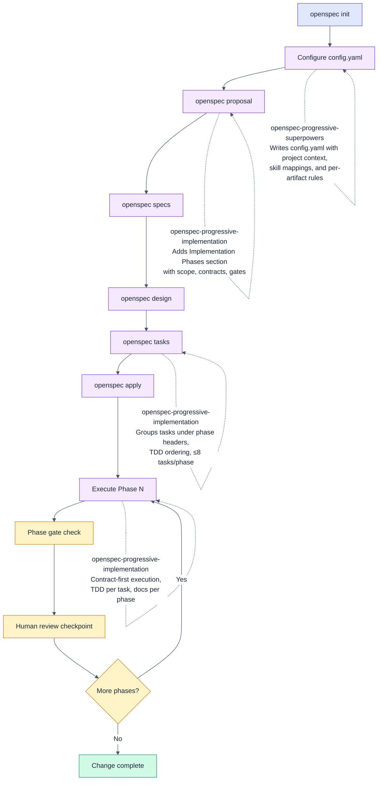

# purbo-skills

AI agent skills that encode engineering taste.

## Installation

```bash
# Install all skills (works with Claude Code, Cursor, and 40+ agents)
npx skills add mpurbo/purbo-skills

# Install a specific skill
npx skills add mpurbo/purbo-skills --skill fp-rust
```

## Skill Families

### FP — Functional Programming

Opinionated skills for FP-first development. Pure-core/imperative-shell architecture, immutability by default, algebraic data types, dependency rejection over injection, and pipeline-oriented programming.

#### fp-rust

Functional Programming in Rust — guidelines for writing idiomatic, FP-first Rust code.

**Covers:** functional core / imperative shell architecture, immutability-first patterns (borrow > clone > mutate), pure functions, algebraic data types, pipeline-oriented programming with iterators and Result chains, error handling as data, dependency rejection over dependency injection, type-driven design (parse don't validate, typestate), concurrency via message passing, and recommended crate stack.

**Triggers on:** any Rust coding task — planning, writing, reviewing, refactoring, scaffolding, project setup, Cargo.toml configuration, or code review.

**Based on:** [Functional Rust: Idiomatic FP Guidelines](skills/fp-rust/references/FP_RUST_GUIDELINES.md), cross-referenced with [Apollo GraphQL Rust Best Practices](https://github.com/apollographql/rust-best-practices).

#### fp-kstream-design

Design Kafka Streams topologies using [Kafka Stream Algebra (KSA)](skills/fp-kstream-design/references/KSA.md) patterns. Produces Mermaid topology diagrams, recipe selection, cost estimates, and compliance checks.

**Triggers on:** "design a topology", "kafka architecture", "stream processing design", "what pattern should I use", "topology review", "KSA".

#### fp-kstream-implement

Implement topologies as testable, deterministic code with pure business logic separated from Kafka wiring. Includes code patterns (stateless transforms, FSMs, enrichment), testing strategy (3-layer), local dev setup (Docker Compose), and Gradle build config.

**Triggers on:** "implement this topology", "write the KStream code", "create the processor", "set up kafka locally", "write tests", "KStream implementation".

**Based on:** [Kafka Stream Algebra v0.5](skills/fp-kstream-implement/references/KSA.md) — 10 composable recipes covering ingress, enrichment, computation, and egress patterns.

---

### OpenSpec — Progressive Implementation

Skills that augment the [OpenSpec](https://github.com/fission-ai/openspec) workflow with phased delivery discipline and cross-session context persistence.

#### How the skills fit into the OpenSpec workflow

OpenSpec defines a structured change workflow: **proposal** → **specs** → **design** → **tasks** → **apply**. The two skills in this family plug into specific steps:

| Workflow Step | Skill | What It Does |
|---|---|---|
| **Setup** (once per project) | `openspec-progressive-superpowers` | Generates `config.yaml` with project context and skill-to-step mappings, so conventions persist across sessions |
| **proposal** | `openspec-progressive-implementation` | Adds `## Implementation Phases` with scope, contracts, gates, and review boundaries per phase |
| **specs** | *(no skill — general practice)* | WHEN/THEN scenarios should be translatable to test cases |
| **design** | *(no skill — general practice)* | Justify decisions with rationale and alternatives |
| **tasks** | `openspec-progressive-implementation` | Groups tasks under phase headers, enforces ≤8 tasks/phase, TDD ordering, per-phase docs |
| **apply** | `openspec-progressive-implementation` | Phase-by-phase execution with hard checkpoints for human review between phases |

`openspec-progressive-superpowers` solves a cross-cutting concern: skills are session-scoped, so conventions (TDD, progressive phases, FP guidelines) get lost when OpenSpec creates artifacts across multiple sessions. It writes `config.yaml` so that every `openspec instructions` call injects the right context and rules.

`openspec-progressive-implementation` enforces structure within the workflow — contract-first phase boundaries, reviewable scope limits, and mandatory checkpoints that prevent the agent from racing ahead without human sign-off.



#### openspec-progressive-implementation

Progressive implementation discipline for OpenSpec changes. Structures work into independently reviewable, testable phases with clear contract boundaries.

**Covers:** phase decomposition in proposals (scope, contracts, gates), task grouping under phase headers, phase checkpoint enforcement during apply, per-phase documentation updates, context management guidance for fresh AI sessions, and anti-rationalization guards.

**Triggers on:** "progressive implementation", "phased implementation", "step-by-step", "implementation phases", "chunked implementation" — or any OpenSpec proposal/tasks/apply workflow where phased delivery is desired.

**Key constraints enforced:**
- ≤8 tasks per phase, reviewable in ≤30 minutes
- Contract-first boundaries — Phase N testable with mocks even without Phase N-1
- Hard stop at phase checkpoints for human review
- Documentation updated every phase (not deferred to the end)

#### openspec-progressive-superpowers

Configures OpenSpec's `config.yaml` to carry project context and development disciplines (TDD, progressive phases, FP conventions) across sessions. A setup skill — run once per project, update when conventions or available skills change.

**Covers:** project context discovery (specs, PRDs, tech stack), available skill mapping to OpenSpec workflow steps (proposal → progressive-implementation, apply → TDD + tech-specific skills), `config.yaml` generation with `context:` and `rules:` sections.

**Triggers on:** "configure openspec", "setup openspec context", "openspec config", "why didn't openspec use TDD", "openspec not invoking skills", "grounding config".

**Problem it solves:** Skills are session-scoped — if you invoke TDD in one session but create artifacts in another, TDD is forgotten. `config.yaml` is the cross-session memory that ensures conventions survive across all OpenSpec workflow steps.

---

### Mermaid — Diagram Styling

#### mermaid-pastel-style

Consistent pastel color styling for mermaid diagrams. Semantic palette mapping node roles (process, decision, success, error, external) to pastel fills with dark text for readability.

**Covers:** `%%{init}%%` directive setup, color palette by semantic role (process=purple, decision=amber, success=green, error=red, routing=indigo), subgraph styling with dashed borders, and a complete flowchart example.

**Triggers on:** creating or editing any mermaid diagram in documentation, specs, or PRDs.

## Adding More Skills

```
skills/
├── fp-rust/                              <- FP family
├── fp-kstream-design/                    <- FP family
├── fp-kstream-implement/                 <- FP family
├── openspec-progressive-implementation/  <- OpenSpec family
├── openspec-progressive-superpowers/     <- OpenSpec family
├── mermaid-pastel-style/                 <- Mermaid family
├── your-new-skill/                       <- add here
│   ├── SKILL.md
│   └── references/                       (optional)
```

Each skill directory must contain a `SKILL.md` with YAML frontmatter (`name` and `description` fields). Installation is handled by the [Vercel skills CLI](https://github.com/vercel-labs/skills), which discovers `SKILL.md` files under `skills/` automatically.

## License

MIT
