# Kafka Stream Algebra (KSA) v0.5

Design discipline for deterministic, replay-safe Kafka Streams topologies.
KSA is a constrained set of composition rules over `KStream`, `KTable`, and `StateStore`.

---

## §1 Principles

Five non-negotiable rules.

| # | Principle | Rule |
|---|-----------|------|
| 1 | **Replay Determinism** | Reprocessing from offset zero produces identical output. |
| 2 | **Partition Locality** | All state scoped to partition key. No cross-partition reads. No global state in processors. |
| 3 | **Explicit State** | Data beyond the incoming event must exist as a Kafka topic. No hidden lookups. |
| 4 | **Side-Effect Boundary** | External I/O (DB, API, notifications) only at the sink. Processors are pure. |
| 5 | **Missing-State Policy** | Every join declares behavior when table side is empty: drop, dead-letter, retry, or buffer. |

---

## §2 Primitives

All topologies compose exactly three primitives.

| Primitive | Signature | State | Use When |
|-----------|-----------|-------|----------|
| **Stateless** | `Event(K,V) → Event(K,V')` | None | Validate, normalize, route, reshape, filter — depends only on current event |
| **Stateful Per-Key** | `Event(K,V) + State(K,S) → Event(K,V') + State(K,S')` | Partition-local, derived from Kafka input | Output depends on history — counters, FSMs, dedup, windows |
| **Stream–Table Join** | `Event(K,V) ⨝ Table(K,S) → Event(K,V')` | KTable from compacted topic | Needs reference data. Join key = partition key. **No HTTP/DB lookups.** |

---

## §3 Diagram Standard

Mermaid `flowchart LR`. Data flows left to right. Compacted topics enter from top/bottom into join nodes. Side-effect sinks are rightmost.

| Symbol | Mermaid | Meaning |
|--------|---------|---------|
| `[TopicName]` | `A[TopicName]` | Kafka topic (stream) |
| `[TopicName*]` | `A[TopicName*]` | Compacted topic (KTable source) |
| `(Processor)` | `A(Processor)` | Stateless processor |
| `{{Processor}}` | `A{{Processor}}` | Stateful processor (has state store) |
| `((Join))` | `A((Join))` | Stream–table join |
| `[[Sink]]` | `A[[Sink]]` | Side-effect boundary |
| `{Decision?}` | `A{Decision?}` | Conditional branch |

Color convention: green=stateless, orange=stateful, red=side-effect, blue=topic.

---

## §4 Recipe Catalog

Recipes organized by position in data flow:

```
Source → [Ingress] → [Enrichment] → [Computation] → [Egress] → Sink
```

| # | Group | Recipe | Primitives | Use Case |
|---|-------|--------|------------|----------|
| 01 | Ingress | Validation & Normalization | Stateless | Inbound event cleaning |
| 02 | Ingress | Deduplication | Stateful | At-least-once dedup |
| 03 | Ingress | Routing & Fan-Out | Stateless | Event type splitting |
| 04 | Enrichment | Data Enrichment | Join + Stateless | Reference data lookup |
| 05 | Enrichment | Enrichment + Stateful Pipeline | Join + Stateful | Fraud scoring, risk assessment |
| 06 | Computation | Windowed Aggregation | Stateful | Rate limiting, activity metrics |
| 07 | Computation | Per-Key State Machine | Stateful | Entity lifecycle |
| 08 | Computation | Saga Orchestrator | Stateful + multi-topic | Cross-service coordination |
| 09 | Egress | CQRS Read Model Projection | Stateful + Sink | Materialized views, search indexes |
| 10 | Egress | Event Replay & Reprocessing | Meta-pattern | Bug fixes, backfills, state rebuilds |

---

### Recipe 01 — Validation & Normalization

Stateless. Invalid events → DLQ, never silently dropped. Normalize produces canonical schema.

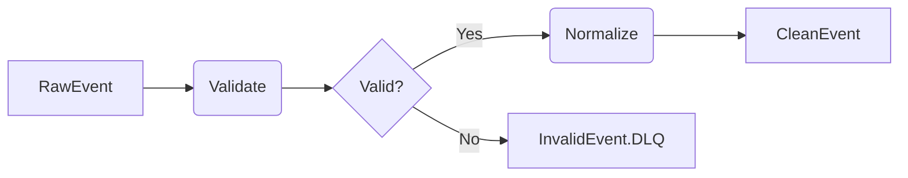

### Recipe 02 — Deduplication

Stateful. Store holds event ID with TTL. Document retention window. Replay-safe.

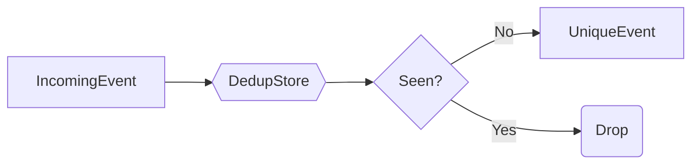

### Recipe 03 — Routing & Fan-Out

Stateless. Pure function of event content. Use `branch` or `flatMap` + `to()`. Every branch has a destination.

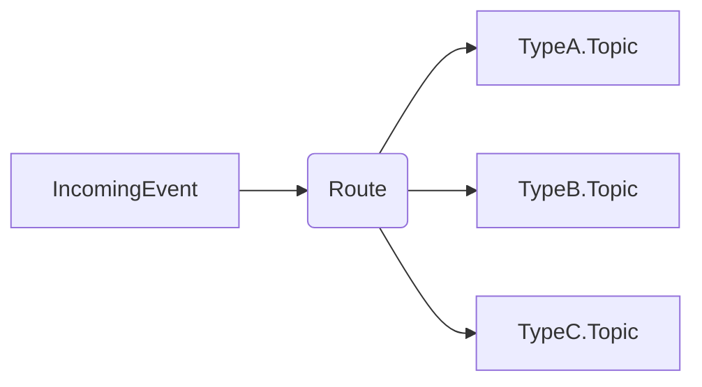

### Recipe 04 — Data Enrichment

Join + Stateless. Reference data in compacted topic → KTable. Join key = partition key (repartition if different). Missing-state policy mandatory (§5.1).

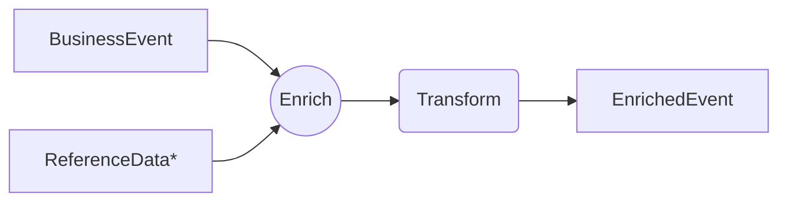

Variants: multi-enrichment (chain joins), self-enrichment (derived from same service).

### Recipe 05 — Enrichment + Stateful Pipeline

Join + Stateful. Enrichment first, then stateful computation. Side-effects at sink only.

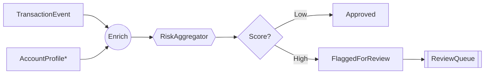

### Recipe 06 — Windowed Aggregation

Stateful. Specify window type (tumbling/hopping/session), grace period, retention. Deterministic under event-time.

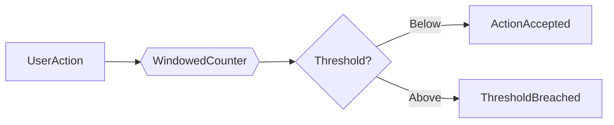

### Recipe 07 — Per-Key State Machine (FSM)

Stateful. Partition by entity ID. Transition is pure: `(currentState, event) → (newState, outputEvents)`. Invalid transitions produce events, never silently ignored. No I/O inside FSM.

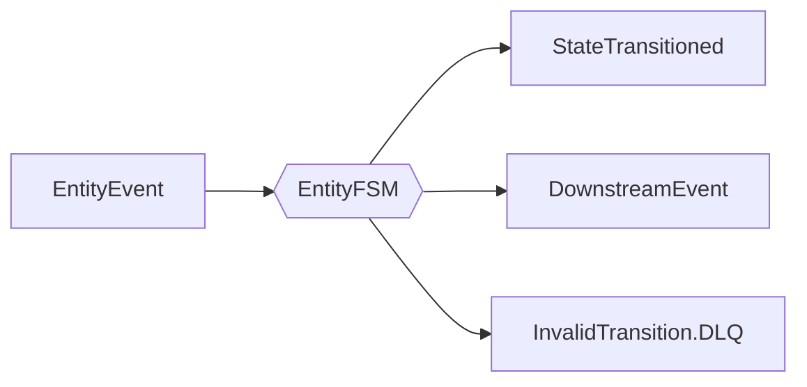

State diagram convention:

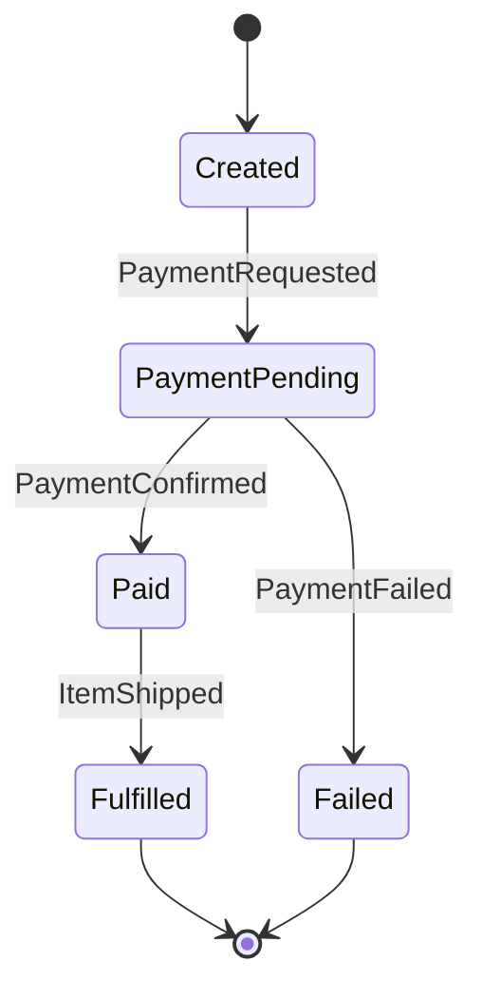

### Recipe 08 — Saga Orchestrator

Specialized FSM (Recipe 07) coordinating across service boundaries with compensation. Partition by saga/correlation ID. State diagram must include happy path and compensation path. Handle timeouts via punctuators or timeout topic.

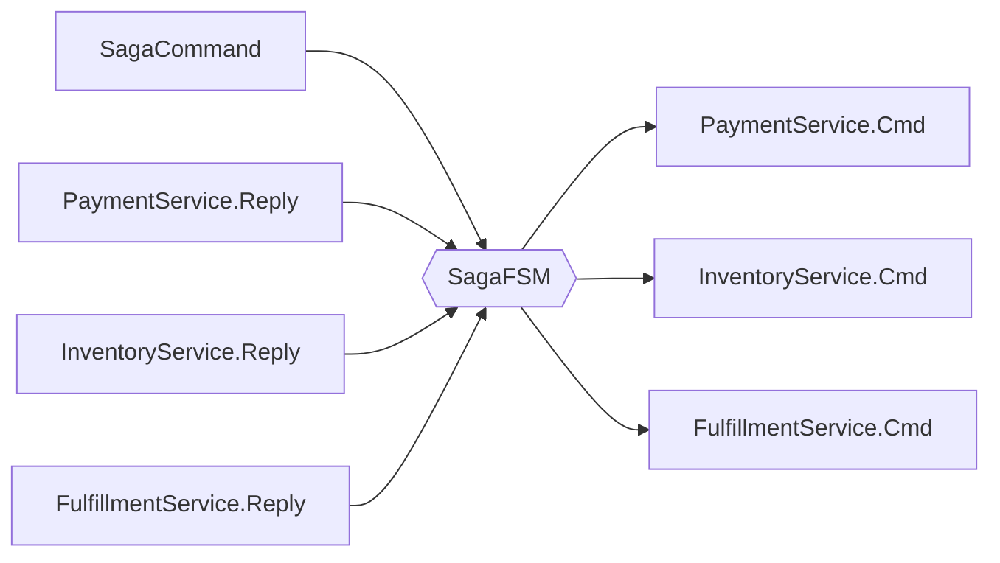

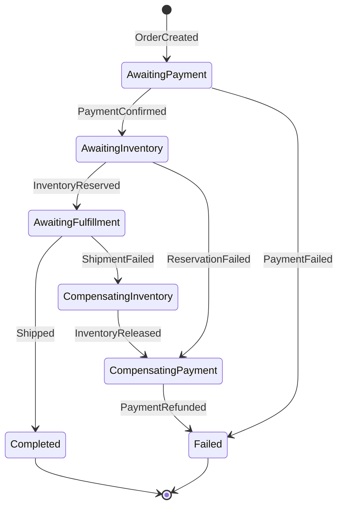

Use Recipe 07 for single-entity lifecycle. Use Recipe 08 when coordinating across service boundaries with compensation.

### Recipe 09 — CQRS Read Model Projection

Stateful + Sink. Projector folds events into view: `(currentView, event) → newView`. Sink is side-effect boundary. Idempotent: replay rebuilds same read model.

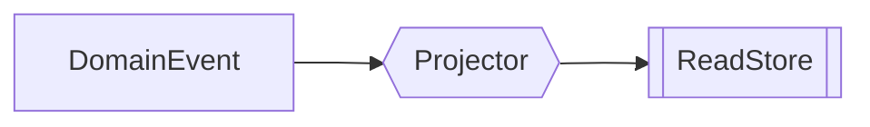

Multi-stream variant (merge with `KStream.merge()`, repartition to same key first):

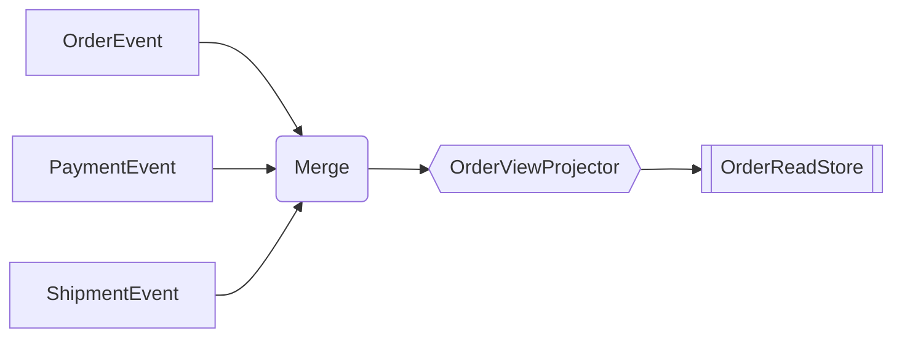

### Recipe 10 — Event Replay & Reprocessing

Meta-pattern. Reset consumer group offsets. Topology produces correct output from any offset (guaranteed if above recipes followed). State stores rebuild from changelog. Sinks must be idempotent (upsert, not insert).

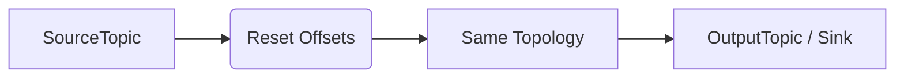

---

## §5 Edge Case Policies

### 5.1 Missing Enrichment State

| Policy | Behavior | When |
|--------|----------|------|
| Drop | Discard null-enriched events | Loss acceptable, data arrives eventually |
| Dead-letter | Route to DLQ | Missing data = defect |
| Retry | Route to retry topic with backoff | Expected but delayed |
| Buffer | Hold in state until table populates | Strict completeness required |

### 5.2 Out-of-Order Events

| Mitigation | How |
|------------|-----|
| Event-time processing | Use event timestamps, not wall-clock |
| Grace period | Accept late events within defined window |
| Idempotent transitions | FSM ignores duplicate/stale transitions |

### 5.3 Cross-Key Aggregation

| Approach | Trade-off |
|----------|-----------|
| Repartition to single key | Small cardinality only; bottleneck risk |
| Hierarchical aggregation | Two-stage: per-partition then global merge |
| Approximation | Probabilistic structures (HyperLogLog) |

### 5.4 Large State Stores

| Risk | Mitigation |
|------|------------|
| Slow restore | Bounded retention (TTL) |
| Disk pressure | Compaction; monitor store size |
| Long rebalance | Standby replicas; incremental cooperative rebalancing |
| Key skew | Composite key sharding |

### 5.5 Late Enrichment Changes

Changing reference data does not fix past output. If correction needed: replay from appropriate offset after reference topic updated.

---

## §6 Compliance Checklist

Verify before production:

- [ ] No external I/O inside processors (HTTP, DB, cache at sink only)
- [ ] All enrichment data is a compacted topic (no injected clients)
- [ ] Every join has declared missing-state policy
- [ ] Partition keys aligned (join keys = partition keys, repartitions explicit)
- [ ] State stores have bounded retention (TTL or compaction)
- [ ] Replay test passes (reset to zero, verify identical output)
- [ ] Invalid transitions are observable (DLQ topics, not logs-only)
- [ ] Sinks are idempotent (upsert semantics)
- [ ] Topology diagram exists using §3 notation

---

## §7 Cost Model

### 7.1 Cost Drivers

| Driver | What Increases Cost | What Controls Cost |
|--------|--------------------|--------------------|
| **State Store Size** | Long/unbounded retention; high-cardinality keys with large values; fine-grained windowed aggregations | Bounded TTLs; small state values (counter, enum, ID); compaction-friendly keys |
| **Repartitioning** | Multiple repartition steps; high-throughput streams repartitioned | Design partition keys upfront for natural join alignment |
| **KTable Materialization** | High cardinality with infrequent compaction; no tombstones; frequently-changing data | Produce tombstones; right-size compacted topics; monitor restore time |
| **Over-Partitioning** | Projected future scale partitioning; mismatched partition counts across joined topics | Start with fewer partitions; align partition counts across joined topics |

### 7.2 When KStreams Fits

| Characteristic | Why |
|----------------|-----|
| Continuous event flow (not request-driven) | Built for this; REST is not |
| Per-key stateful logic | Durable partition-local memory |
| Replay/auditability requirements | Deterministic replay built in |
| Event-time processing | Windowing, grace periods, out-of-order |
| Multiple consumers of same event | Topic decoupling vs RPC fan-out |
| Slowly-changing enrichment data | KTable joins cheaper than HTTP under load |

### 7.3 When KStreams Doesn't Fit

| Characteristic | Use Instead |
|----------------|-------------|
| Low throughput, request-response | REST/gRPC + database |
| Simple CRUD, no event history | REST/gRPC + database |
| Lookup-heavy, write-light | Service + cache/DB |
| Extreme key cardinality + large state | Database with indexed queries |
| Multi-dimensional joins across unrelated keys | Batch ETL or Flink |
| Spiky, low-frequency workloads | Serverless or batch jobs |
| Synchronous response required | REST/gRPC service |

### 7.4 Cost Estimation

| Factor | Estimate | Red Flag |
|--------|----------|----------|
| State store size/key | value size × unique keys × retention | > 50 GB/instance |
| Changelog overhead | state store size × replication factor | > 100 GB total |
| Repartition count | number of selectKey/through calls | > 2 on high-throughput |
| KTable restore time | compacted topic size / network throughput | > 10 minutes |
| Partition count | sum across all internal + output topics | > 500 total |

Multiple red flags → design review. Consider alternatives (§7.3).

---

## §8 Limitations

| Requirement | Why KSA Doesn't Fit | Consider Instead |
|-------------|---------------------|------------------|
| Sub-10ms sync response | Inherent stream latency | gRPC + cache |
| Multi-way analytical joins | Not OLAP | Flink, Spark, ClickHouse |
| Cross-partition ACID | No global coordinator | Database + 2PC |
| Global consistent counters | Partition locality prevents consensus | Redis, distributed lock |
| Request–response RPC | Event-driven, not request-driven | REST/gRPC |

---

## §9 Composition Rules

Compose recipes left to right: `Source → [Ingress] → [Enrichment] → [Computation] → [Egress] → Sink`. Not every stage needed.

### Example — Payment Processing

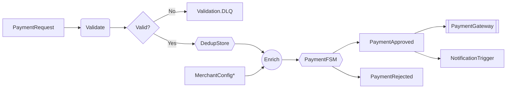

Recipes: 01 (validation) → 02 (dedup) → 04 (enrichment) → 07 (FSM) → sink.

### Example — Notification Dispatch

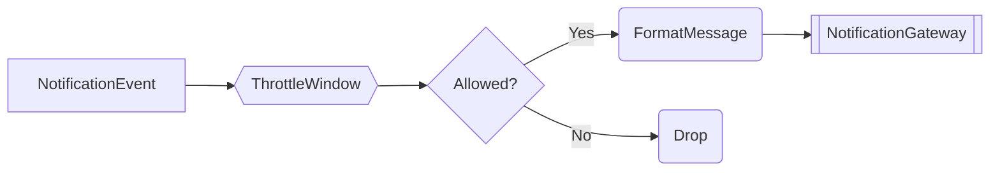

Recipes: 06 (windowed throttle) → stateless transform → sink.

### Example — Merchant Onboarding

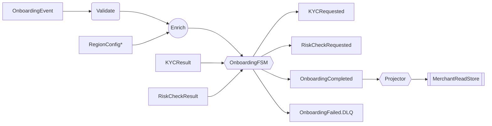

Recipes: 01 (validation) → 04 (enrichment) → 08 (saga) → 09 (CQRS projection).

---

*End of KSA v0.5*
