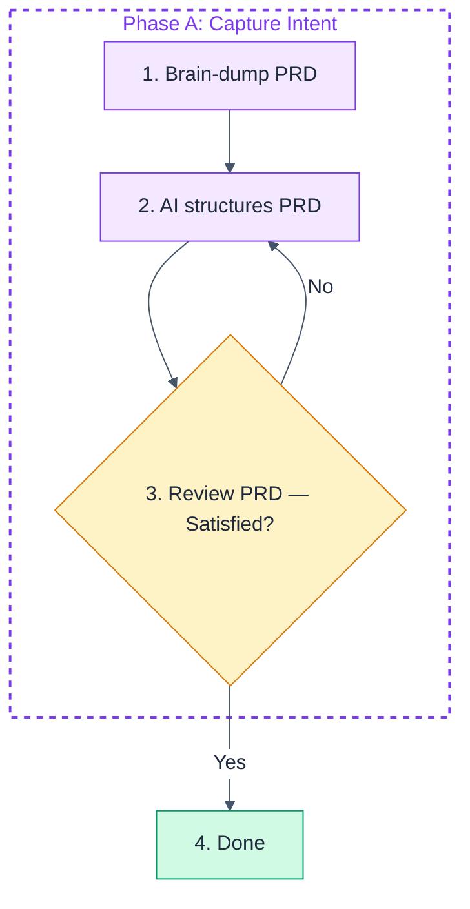

# Mermaid Diagram Color Style Guide

When creating or editing mermaid diagrams, apply this pastel color palette using the `%%{init}%%` directive and per-node `style` directives.

## Init Directive (Required)

Every mermaid block must start with this line immediately after the opening fence:

```
%%{init:{'theme':'base','themeVariables':{'primaryTextColor':'#1e293b','lineColor':'#475569','edgeLabelBackground':'#ffffff','tertiaryTextColor':'#1e293b'}}}%%
```

This ensures:
- **Node text**: dark slate (`#1e293b`) — readable on pastel backgrounds
- **Arrow/line color**: dark grey (`#475569`) — visible connectors
- **Edge label background**: white (`#ffffff`) — clean label readability
- **Edge label text**: dark slate (`#1e293b`) — black text on white background

## Color Palette by Node Semantic Role

All node styles must include `color:#1e293b` for readable text.

| Role | Fill | Stroke | Use For |
|------|------|--------|---------|
| **Process / Action** | `#f3e8ff` | `#7c3aed` | Steps, tasks, operations, computations |
| **Decision** | `#fef3c7` | `#d97706` | Yes/no questions, validation checks, conditionals |
| **Routing / Flow Control** | `#e0e7ff` | `#4f46e5` | Loop conditions, "more items?" checks, navigation |
| **Success / Terminal** | `#d1fae5` | `#059669` | Completion, done, exit success, output artifacts |
| **Error / Failure** | `#fee2e2` | `#dc2626` | Failures, error exits, log failures |
| **External / IO** | `#fef3c7` | `#d97706` | External APIs, third-party services |
| **Interface / Trait** | `#e0e7ff` | `#4f46e5` | Trait definitions, abstract interfaces |
| **Implementation** | `#dbeafe` | `#2563eb` | Concrete implementations, provider-specific blocks |
| **Start / Entry** | `#e0e7ff` | `#4f46e5` | Entry points, start nodes |

## Subgraph Styling

Subgraphs use dashed borders with no fill. Assign distinct stroke colors to differentiate groups:

```
style subgraph_a fill:none,stroke:#7c3aed,stroke-dasharray: 5 5,stroke-width:2px,color:#7c3aed
style subgraph_b fill:none,stroke:#2563eb,stroke-dasharray: 5 5,stroke-width:2px,color:#2563eb
style subgraph_c fill:none,stroke:#059669,stroke-dasharray: 5 5,stroke-width:2px,color:#059669
```

Available subgraph stroke colors (cycle through as needed):
- `#7c3aed` (purple)
- `#2563eb` (blue)
- `#059669` (green)
- `#d97706` (amber)
- `#dc2626` (red)

**Important**: Subgraph IDs must be unquoted identifiers (e.g., `subgraph my_group ["Display Label"]`), not quoted strings, for `style` directives to work.

## Example



## Rules

1. Always start with the `%%{init}%%` directive for global text/line/label colors.
2. Always add `color:#1e293b` to every node `style` directive for dark text on pastel fills.
3. Map node roles to palette colors semantically, not randomly.
4. Place all `style` lines at the end of the mermaid block, after edge definitions.
5. Keep consistent within a document — same role = same color across all diagrams.
