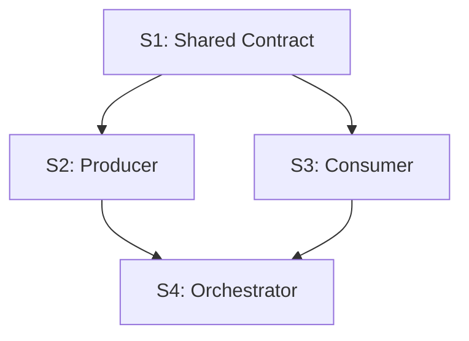

# System Spec Brainstorm

Create a high-level **System Spec** from a user brain-dump. The document should
be strategic enough to avoid premature implementation detail, but concrete
enough that each subsystem can later be designed and implemented in an isolated
AI coding session.

**Core principle:** Model the system as a composition of functions. Each
subsystem is an independently testable unit with explicit inputs, outputs, and
contracts. Dependencies are allowed, but coupling must flow through named
contracts rather than hidden implementation knowledge.

## When to Use

- The user asks for a high-level system specification, architecture spec, or
  markdown system spec from an initial idea.
- The user provides a brain-dump and wants subsystem boundaries identified.
- The output should feed `subsystem-design-spec` and later OpenSpec workflow.
- The user needs development sequencing: what comes first, what can run in
  parallel, and what should integrate last.

**Use with `superpowers:brainstorming` when available.** Let brainstorming
explore intent, alternatives, and constraints; use this skill to turn the
result into the concrete System Spec document.

**Do NOT use for:**
- Per-subsystem implementation planning — use `subsystem-design-spec`.
- OpenSpec proposal/specs/design/tasks artifacts — use OpenSpec workflow.
- Low-level phase breakdown or task lists — those belong in subsystem specs.

## Output Location

If the user specifies a path, write the System Spec there. Otherwise default to:

```text
docs/spec/system-spec.md
```

Create parent directories if needed.

## Process

### Step 1: Normalize the Brain-Dump

Extract and clarify:

- **System purpose:** What problem this solves and for whom.
- **Primary usage flow:** How the user expects to interact with the system.
- **Hard constraints:** Supported platforms, languages, dependencies, runtime
  boundaries, external tools, data limits, security requirements.
- **Success criteria:** Observable outcomes that make the system useful.
- **Open questions:** Important unknowns that should not block a v1 spec.

Ask at most one concise clarification question only if a missing answer changes
the subsystem decomposition materially. Otherwise state assumptions and proceed.

### Step 2: Identify Subsystems by Contract Boundaries

Choose subsystem boundaries that minimize cross-session context. A good
subsystem:

- Owns one coherent responsibility.
- Has stable input and output contracts.
- Can be tested with fixtures, mocks, or schema validation.
- Can be developed without reading every other subsystem's implementation.
- Exposes behavior through files, schemas, APIs, events, CLI contracts, or
  interfaces rather than shared internals.

Prefer capability slices over technology buckets. For example, "Source
Collector that emits Graph IR" is usually better than "Backend code" because
its contract and fixtures are clearer.

Assign subsystem codes in dependency-friendly order:

```text
S1: Foundational contract or data model
S2..S{n-1}: Independent producers/consumers around that contract
S{n}: Integration/orchestration shell
```

When a subsystem is too broad, split it. When two subsystems cannot be tested
independently, merge them or introduce a missing contract subsystem.

### Step 3: Define Contracts

For each subsystem, define high-level contract boundaries:

- **Contract IN:** Data, commands, files, events, API calls, or user actions
  consumed by the subsystem.
- **Contract OUT:** Data, files, events, API responses, rendered UI state, or
  side effects produced by the subsystem.
- **Source:** Where each input comes from.
- **Destination:** Where each output goes.
- **Validation:** How the contract can be checked in isolation.

Keep contracts high-level, but name concrete artifacts where useful:

- `schemas/*.schema.json`
- `fixtures/*`
- `GET /api/...`
- CLI arguments and exit codes
- event names and payload shapes
- database table ownership
- generated files and directory layouts

### Step 4: Map Dependencies and Parallelism

Produce both:

1. **A dependency table** showing each subsystem, its dependencies, and whether
   it can start immediately, after a contract exists, or only during final
   integration.
2. **A Mermaid DAG** showing subsystem dependencies and parallelizable lanes.

Development flow should usually follow:

1. **Contracts first:** schemas, protocol definitions, fixtures, or interface
   contracts that unblock other subsystems.
2. **Parallel producers/consumers:** subsystems that can use fixtures or mocks
   once contracts exist.
3. **Adapters and integrations:** external systems, AI calls, IO wrappers, or
   provider-specific implementations.
4. **Orchestration last:** CLI, shell, app wiring, deployment, or end-to-end
   integration.

Explicitly call out parallel work, for example:

```text
After S1 is stable, S2, S3, and S4 can proceed in parallel using S1 fixtures.
S6 should wait until S2-S5 expose their CLI/API/file contracts.
```

### Step 5: Write the System Spec

Use this structure unless the project has established conventions:

```markdown
# {System Name}: System Specification

> High-level system specification for {one-sentence purpose}.

## 1. Overview
## 2. Goals and Non-Goals
## 3. Requirements and Usage Flows
## 4. Design Principles
## 5. System Architecture
### 5.1 Subsystem Overview
### 5.2 Subsystem Dependency Diagram
## 6. Subsystems
### S1: {Subsystem Name}
### S2: {Subsystem Name}
...
## 7. Subsystem Dependency Map
## 8. Contract Matrix
## 9. Independent Test Strategy
## 10. Development Flow
## 11. Technology Choices
## 12. Risks and Open Questions
## 13. Future Considerations
```

Each subsystem section must include:

```markdown
### S{n}: {Subsystem Name}

**Purpose:** ...
**Owns:** ...
**Does not own:** ...
**Contract IN:** ...
**Contract OUT:** ...
**Depends on:** ...
**Consumed by:** ...
**Isolation strategy:** How to test/develop this subsystem without the real
upstream/downstream subsystem.
```

### Step 6: Include Mermaid Diagrams

Every System Spec should include at least one Mermaid diagram:

- A subsystem dependency DAG.
- Optional: a high-level runtime/data flow diagram if different from the
  dependency graph.

If `mermaid-pastel-style` is available, follow its styling rules. If not,
still include valid Mermaid with readable labels.

Recommended dependency diagram shape:



### Step 7: Add Quality Gates

Before finalizing, verify:

- [ ] The spec stays high-level and does not become an implementation plan.
- [ ] Every subsystem has explicit input and output contracts.
- [ ] Every subsystem can be developed or tested with fixtures, mocks, schemas,
      or documented API contracts.
- [ ] Cross-subsystem dependencies are named in a dependency map.
- [ ] Parallelizable subsystems are explicitly identified.
- [ ] Integration/orchestration work is last unless there is a justified reason.
- [ ] Mermaid diagram reflects the same dependency order as the dependency map.
- [ ] The spec is ready to feed `subsystem-design-spec` one subsystem at a time.

## Contract Matrix Template

Use a table like this in the System Spec:

```markdown
| Boundary | Producer | Consumer | Contract | Validation |
|----------|----------|----------|----------|------------|
| S1 -> S2 | S1 | S2 | `ExampleContract` schema/file/API | fixture + schema validation |
```

## Development Flow Template

Use a concise sequencing section:

```markdown
## 10. Development Flow

1. **S1 first:** establishes shared contracts and fixtures.
2. **S2 + S3 in parallel:** consume S1 fixtures and expose independent outputs.
3. **S4 after S2/S3 contracts:** integrates through documented interfaces.
4. **S5 last:** end-to-end orchestration and user-facing workflow.

Parallelizable:
- S2 and S3 can run in separate AI coding sessions after S1 exists.
- S4 can start with mocks once S2/S3 contracts are stable.
```
